# 🌌 Nebula Test Architect

**Nebula** is a local, AI-powered test case generation tool. It leverages **Ollama** and **Large Language Models (LLMs)** to convert natural language requirements or code snippets into structured, professional test suites—keeping 100% of your data on your local machine.

---

## 🏗️ Architecture

The system follows the **A.N.T. (Action, Nexus, Trigger)** architecture to ensure deterministic outputs from probabilistic models.

```mermaid
graph TD
    User([👤 User]) -->|Input Requirement| UI[Trigger Layer: Streamlit UI]
    UI -->|Payload| Nexus[Nexus Layer: llm_engine.py]
    
    subgraph Local Environment
        Nexus -->|Prompt + JSON Schema| Ollama[Action Layer: Ollama API]
        Ollama -->|"LLM Inference (Llama 3.2)"| Nexus
    end
    
    Nexus -->|Validate & Clean JSON| UI
    UI -->|Render Badges & Tables| User
```



### Components
1.  **Trigger Layer (`app.py`)**: A modern **Streamlit** dashboard that handles user input and visualizes results with badges (✅ Positive, 🔸 Negative).
2.  **Nexus Layer (`tools/llm_engine.py`)**: The application logic that constructs strict prompts, enforces JSON schemas, and handles errors (e.g., if Ollama is down).
3.  **Action Layer (Ollama)**: The local AI server running models like `llama3.2` to generate the actual content.

---

## 🚀 Getting Started

### Prerequisites
1.  **Python 3.8+** installed.
2.  **Ollama** installed and running. [Download Ollama](https://ollama.com)
3.  **Model Pulled**:
    ```bash
    ollama pull llama3.2
    ```

### Installation

1.  Clone the repository.
2.  Install dependencies:
    ```bash
    pip install -r requirements.txt
    ```

### Running the App

1.  Ensure Ollama is running (`ollama serve` or via Desktop app).
2.  Launch Nebula:
    ```bash
    streamlit run app.py
    ```
3.  Open your browser to `http://localhost:8501`.

---

## 📂 Project Structure

```text
AItesterBlueprint/
├── app.py                  # Main Streamlit Application (Frontend)
├── requirements.txt        # Python Dependencies
├── architecture/           # SOPs and Design Docs
│   └── test_generation_sop.md
├── tools/                  # Core Logic Scripts
│   └── llm_engine.py       # Interacts with Ollama & Parses JSON
└── README.md               # Project Documentation
```

## 🛡️ Features

-   **Zero Data Leakage**: All processing happens on localhost.
-   **Structured JSON**: Outputs are ready for automation frameworks.
-   **Smart Categorization**: Automatically tags tests as ✅ Positive, 🔸 Negative, or 🛡️ Security.
-   **Multi-Model Support**: Switch between Llama 3, Mistral, or DeepSeek from the sidebar.
